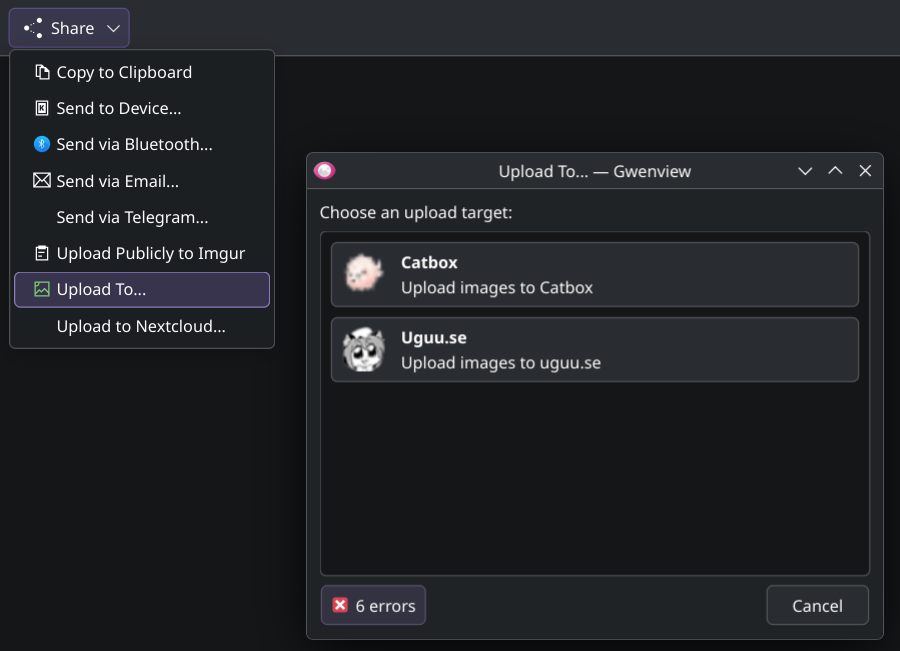

# plasma-share-uploader

Create custom upload targets for the KDE Plasma 6 Share menu. [Catbox](https://catbox.moe/) and [Uguu](https://uguu.se/) included by default.



## License

GPL-3.0-or-later. See `LICENSE`.

## Build

```sh
cmake -S . -B build
cmake --build build
```

## Install

```sh
cmake --install build
```

Plugins install to the Purpose plugin directory (`${KDE_INSTALL_QTPLUGINDIR}/kf6/purpose`).
Restart Dolphin/Gwenview/other Purpose-Share-enabled app after installing so the new Share action shows up.

## Targets

Targets live in `targets.json`. Each entry generates its own Share plugin at configure time.
After editing `targets.json`, re-run the configure step (`cmake -S . -B build`) so plugins are regenerated.
Example targets are stored in `targets.sample.json` for reference when adding new services.

Supported response parsers:
- `text_url`: expects the response body to be the URL.
- `regex`: extract the URL with a regex `pattern` and optional `group`.
- `json_pointer`: extract the URL using a JSON Pointer string in `pointer`, e.g. `/files/0/url`.

Request headers can be supplied in `request.headers`. Values support `${ENV:VARNAME}` substitution
at runtime (useful for API keys such as Imgur's Client-ID).

### Adding a new target

Each target entry is an object inside the `targets` array. Required fields:
- `id`: lowercase identifier used for plugin names; `[a-z0-9][a-z0-9_-]*`.
- `displayName`: human-friendly name shown in Share menus.
- `description`: short description for plugin metadata.
- `icon`: icon name (e.g. `image-x-generic`).
- `request`: upload configuration (see below).
- `response`: how to extract the URL from the server response.

Optional fields:
- `pluginTypes`: Purpose plugin types (defaults to `["ShareUrl"]`).
- `constraints`: Purpose constraints (e.g. `["mimeType:image/*"]`).

### Request formats

`request` must include:
- `url`: upload endpoint URL. Supports `${ENV:VAR}` substitution.
- `method`: HTTP method. `POST` for multipart; `POST` or `PUT` for raw uploads.
- `type`: `multipart` (default) or `raw`.

Multipart uploads:
- `request.type`: `multipart` (or omitted).
- `request.multipart.fileField`: form field name for the file.
- `request.multipart.fields`: optional extra form fields.

Raw uploads:
- `request.type`: `raw`.
- `request.url` may include `${FILENAME}` to inject the local file name (e.g. transfer.sh).
- `request.contentType`: optional Content-Type to set for the file body.

Headers:
- `request.headers`: object of header name -> value, values support `${ENV:VARNAME}` substitution.

### Response formats

`response` must include a `type`:
- `text_url`: response body is the URL.
- `regex`: use `pattern` and optional `group` to extract URL from response text.
- `json_pointer`: use `pointer` to locate a string URL in a JSON response.

### Example

```json
{
  "id": "example",
  "displayName": "ExampleHost",
  "description": "Upload images to ExampleHost",
  "icon": "image-x-generic",
  "pluginTypes": ["ShareUrl", "Export"],
  "constraints": ["mimeType:image/*"],
  "request": {
    "url": "https://example.com/upload",
    "method": "POST",
    "multipart": {
      "fields": {
        "token": "${ENV:EXAMPLE_TOKEN}"
      },
      "fileField": "file"
    }
  },
  "response": {
    "type": "json_pointer",
    "pointer": "/data/url"
  }
}
```
