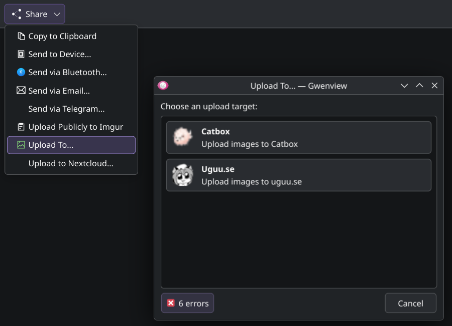

# Plasma Share Uploader

Create custom upload targets for the KDE Plasma 6 Share menu. New targets are user-definable in JSON; no code modification required. [Catbox](https://catbox.moe/) and [Uguu](https://uguu.se/) included by default.



## License

GPL-3.0-or-later.

## Build

```sh
cmake -S . -B build
cmake --build build
```

## Install

```sh
cmake --install build
```

Plugins install to the Purpose plugin directory (`${KDE_INSTALL_QTPLUGINDIR}/kf6/purpose`).
Restart Dolphin/Gwenview/other Purpose-Share-enabled app after installing so the new Share action shows up.

## Targets

Targets live in `targets.json`. Each entry generates its own Share plugin at configure time.
After editing `targets.json`, re-run the configure step (`cmake -S . -B build`) so plugins are regenerated.
Additional example targets are available in `targets.sample.json` for reference when adding new services.

### Adding a new target

Each target entry is an object inside the `targets` array. Required fields:
- `id`: lowercase identifier used for plugin names; `[a-z0-9][a-z0-9_-]*`.
- `displayName`: human-friendly name shown in Share menus.
- `description`: short description for plugin metadata.
- `icon`: icon name (e.g. `image-x-generic`).
- `request`: upload configuration (see below).
- `response`: how to extract the URL from the server response.

Optional fields:
- `pluginTypes`: Purpose plugin types (defaults to `["ShareUrl"]`).
- `constraints`: Purpose constraints (e.g. `["mimeType:image/*"]`).
- `preUpload`: ordered list of per-file preprocessing rules to run before upload.

### Request formats

`request` includes:
- `url`: upload endpoint URL. Supports `${ENV:VAR}` substitution.
- `method`: HTTP method. `POST` for multipart; `POST` or `PUT` for raw uploads.
- `type` (optional): `multipart` (default) or `raw`.

Multipart uploads:
- `request.type`: `multipart` (or omitted).
- `request.multipart.fileField`: form field name for the file.
- `request.multipart.fields`: optional extra form fields (string values only).

Raw uploads:
- `request.type`: `raw`.
- `request.url` may include `${FILENAME}` to inject the local file name (e.g. transfer.sh).
- `request.contentType`: optional Content-Type to set for the file body.

Headers:
- `request.headers`: object of header name -> value (string values only), values support `${ENV:VARNAME}` substitution.

### Pre-upload commands

Targets may optionally define `preUpload` rules to transform a file before it is uploaded.
Rules are evaluated once per file, in order. The first matching rule is used. If no
rule matches, the original file is uploaded unchanged.

Each `preUpload` entry must include:
- `mime`: non-empty array of MIME patterns. Supported forms are exact MIME types such as `image/png`, wildcard subtype patterns such as `image/*`, and `*/*` to match any MIME type.
- `fileHandling`: one of:
  - `inplace_copy`: copy the original file to a temporary path, substitute `${FILE}` with that temporary path, run one or more commands in place on the copy, then upload the modified copy.
  - `output_file`: substitute `${FILE}` with the original file path and `${OUT_FILE}` with a temporary output path, run exactly one command, then upload `${OUT_FILE}`.
- `commands`: non-empty array of command objects.
  - `inplace_copy` rules may contain one or more commands.
  - `output_file` rules must contain exactly one command.

Each command object must include:
- `argv`: non-empty array of command arguments. Commands are executed directly without a shell.

Available placeholders in `argv`:
- `${FILE}`: required in every command.
- `${OUT_FILE}`: required for `output_file`, and not allowed for `inplace_copy`.

Behavior:
- First matching `preUpload` rule wins.
- No match: upload the original file.
- Non-zero exit, timeout, or missing output file: fail that upload and surface stderr.
- Original user files are never modified.

If you want a catch-all fallback rule, use `*/*` and place it last.

### Response formats

`response` must include a `type`:
- `text_url`: response body is the URL.
- `regex`: use `pattern` and optional `group` to extract URL from response text.
- `json_pointer`: use `pointer` (must start with `/`) to locate a string URL in a JSON response.

### Example

```json
{
  "id": "example",
  "displayName": "ExampleHost",
  "description": "Upload images to ExampleHost",
  "icon": "image-x-generic",
  "pluginTypes": ["ShareUrl", "Export"],
  "constraints": ["mimeType:image/*"],
  "request": {
    "url": "https://example.com/upload",
    "method": "POST",
    "multipart": {
      "fields": {
        "token": "${ENV:EXAMPLE_TOKEN}"
      },
      "fileField": "file"
    }
  },
  "preUpload": [
    {
      "mime": ["image/*"],
      "fileHandling": "inplace_copy",
      "commands": [
        {
          "argv": ["exiv2", "rm", "${FILE}"]
        },
        {
          "argv": ["oxipng", "--strip", "all", "${FILE}"]
        }
      ]
    }
  ],
  "response": {
    "type": "json_pointer",
    "pointer": "/data/url"
  }
}
```
