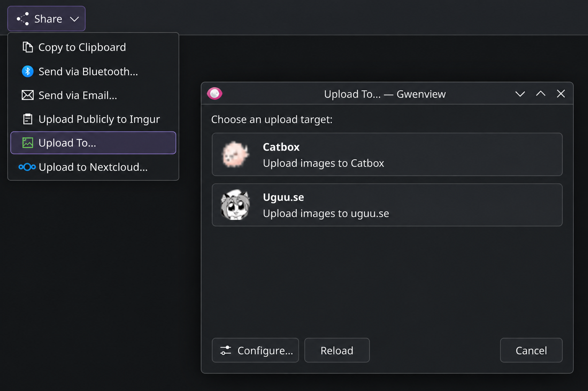

# Plasma Share Uploader

Create runtime-configurable upload targets for the KDE Plasma 6 Share menu. The package ships one generic `Upload To...` action that loads targets from JSON at runtime. [Catbox](https://catbox.moe/) and [Uguu](https://uguu.se/) are included by default.



## License

GPL-3.0-or-later.

## Build

Requires Qt 6.8 or newer (including Qt Declarative/Quick Controls), KF6 Purpose,
CoreAddons, Notifications, Wallet, Kirigami, KDE's QQC2 desktop style, CMake,
and Extra CMake Modules. On Arch, the additional UI packages are
`qt6-declarative`, `kirigami`, and `qqc2-desktop-style`.

```sh
cmake -S . -B build
cmake --build build
```

## Test

Tests additionally require Python 3 and `jsonschema`. An isolated environment
keeps these development dependencies out of the system installation:

```sh
python3 -m venv /tmp/plasma-share-test-venv
/tmp/plasma-share-test-venv/bin/pip install -r tests/requirements.txt
cmake -S . -B build -DBUILD_TESTING=ON -DPython3_EXECUTABLE=/tmp/plasma-share-test-venv/bin/python
cmake --build build
ctest --test-dir build --output-on-failure
```

The test suite compares the JSON Schema and C++ validator against bundled targets
and a shared valid/invalid fixture corpus. It also includes C++ unit and integration tests that use a local in-process HTTP
server, Qt Quick tests exercising the configuration controls, and tests loading
the built plugin through Purpose's real controller. It does not contact external
upload services or require a real wallet. CTest uses the offscreen platform.

Run QML type and binding checks with `cmake --build build --target imshare_ui_qmllint`.
See the [QML migration validation](docs/qml-migration-validation.md) for coverage
and desktop verification details, and [format validation](docs/target-format-validation.md)
for the schema and parser coverage.

## Install

```sh
cmake --install build
```

The plugin installs to Qt's system plugin search path under `kf6/purpose`, using
[`KDEInstallDirs6`](https://api.kde.org/ecm/kde-module/KDEInstallDirs6.html). Installation there usually requires administrator privileges.
Bundled targets install under `${CMAKE_INSTALL_PREFIX}/share/plasma-share-uploader/targets/`.
The `plasma-share-uploader-config` executable and **Plasma Share Uploader Settings** desktop launcher
are installed alongside the plugin.
Both interfaces use embedded QML resources; no QML files from the checkout are
needed at runtime. The standalone manager defaults to KDE's desktop control style
and respects Qt's `-style`, `QT_QUICK_CONTROLS_STYLE`, and
`QT_QUICK_CONTROLS_CONF` overrides. The picker inherits its host's style.
The default prefix follows KDE's installation (normally `/usr`, also used by the
Arch package); set `CMAKE_INSTALL_PREFIX` at configure time to override it.
For a custom plugin location, set `KDE_INSTALL_QTPLUGINDIR` at configure time and
add that directory to the host application's `QT_PLUGIN_PATH`.
Restart Dolphin/Gwenview/other Purpose-Share-enabled app after installing so the `Upload To...` Share action shows up.

Installed builds use installed presets and icons. To use the checkout as the
preset and icon source during development, configure with
`-DPLASMA_SHARE_UPLOADER_USE_SOURCE_DATA=ON`. This controls initial default links;
existing active entries keep their current destinations.

## Targets

The active target directory is `~/.config/plasma-share-uploader/targets/`
(or `$XDG_CONFIG_HOME/plasma-share-uploader/targets/` when set). Only top-level
`*.json` files in this directory are loaded:

- Symlinks enable packaged presets and receive their updates automatically.
- Regular files are independent custom targets.
- Subdirectories, including `disabled/`, are ignored.

When the directory does not exist, the first share creates it with links to the
bundled Catbox and Uguu presets. An existing directory is used exactly as it is,
even if empty. New presets shipped in later package versions are not automatically
enabled in an existing directory.

Packaged presets live under
`${CMAKE_INSTALL_PREFIX}/share/plasma-share-uploader/targets/` (normally `/usr/share/...`).
Their filenames stay stable across releases so enabled links continue to work.
The `examples/` subdirectory contains templates that need configuration before use.
See [target API verification](docs/target-api-verification.md) for their upstream
references, setup requirements, and verification limits.

For example, enable Catbox with:

```sh
target_dir="${XDG_CONFIG_HOME:-$HOME/.config}/plasma-share-uploader/targets"
mkdir -p "$target_dir"
ln -s /usr/share/plasma-share-uploader/targets/catbox.json "$target_dir/catbox.json"
```

Disable a linked preset by removing its link. To preserve a custom configuration
while disabling it, move the file into `targets/disabled/`; move it back to re-enable
it. Keeping the active directory itself preserves an intentionally empty selection.

To customize an enabled preset, replace its symlink with a copy of the packaged
JSON before editing. The copy is independent and will no longer receive packaged
updates. Do not edit through the symlink. Keep only one active definition for each
`id`; duplicate IDs produce a diagnostic, and the first valid file in filename
order is used.

The target directory is read each time you start a new share. Invalid configs and
broken links produce file-specific diagnostics in the picker.

For updating an existing installation, see [the release notes](CHANGELOG.md).

## Configuration app

Open **Plasma Share Uploader Settings** from the application menu, run `plasma-share-uploader-config`,
or choose **Configure...** in the Share picker. Manage presets and custom targets,
edit every supported target field or the complete JSON, store credentials in
KWallet, and import/export our JSON format. Changes use explicit Save; new targets
and imports start as disabled drafts.

The Test page provides local validation, offline response parsing, preprocessing
previews, and explicit test uploads through the same engine as the plugin.
See the [configuration app guide](docs/configuration-app.md) for workflows and
the [configuration application plan](docs/configuration-app-plan.md) for later work.

## Target format

Targets use **schemaVersion 1**, shared by the manager and Share plugin. The
[complete format reference](docs/target-format.md) covers required fields,
acceptance rules, request bodies, credentials, extractors, and preprocessing.
A [JSON Schema](schemas/target-v1.schema.json) is provided for editor validation.

```json
{
  "schemaVersion": 1,
  "id": "example",
  "displayName": "ExampleHost",
  "accept": {"mimeTypes": ["image/png", "image/jpeg"]},
  "request": {
    "url": "https://example.com/upload",
    "method": "POST",
    "body": {"type": "multipart", "fileField": "file"}
  },
  "response": {
    "url": {"type": "json_pointer", "pointer": "/data/url"}
  }
}
```

MIME entries are alternatives; MIME and extension filters must both match when
both are supplied. The shared URL and any nonempty thumbnail/deletion URL must
be absolute HTTP(S) URLs. Metadata is optional except for `id`.

Older custom targets require a manual update; follow
[Updating older targets](docs/target-format.md#updating-older-targets) when
installing the matching plugin and manager. Linked packaged presets update with
the package. No automatic migration or compatibility overlay is used.
